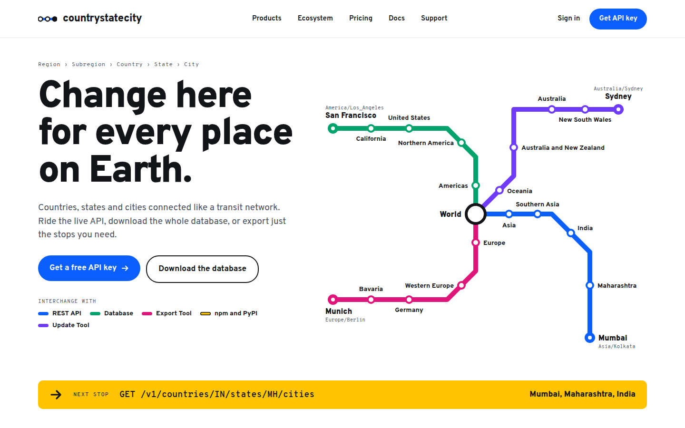
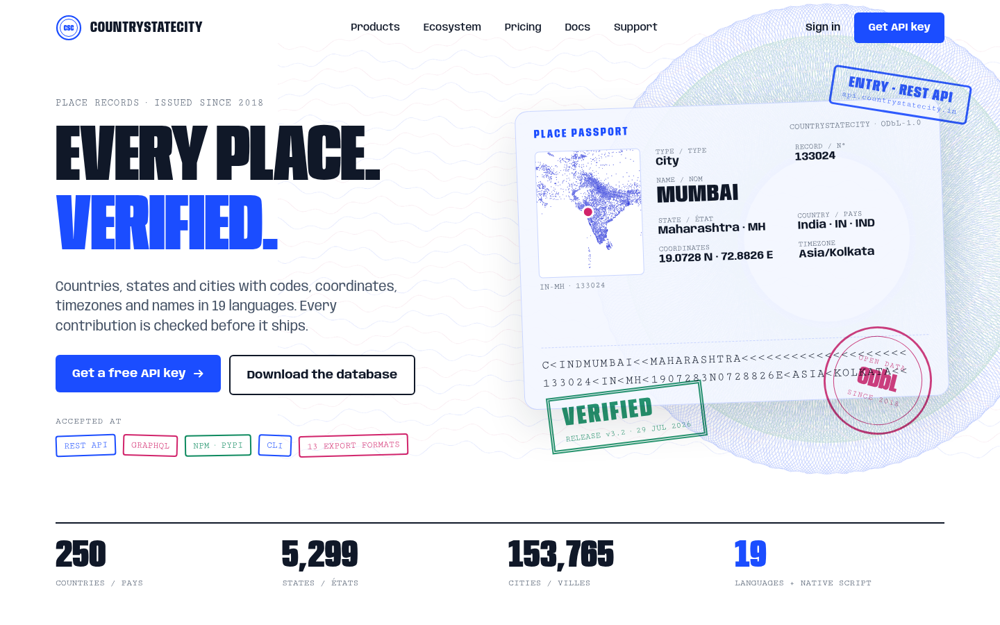
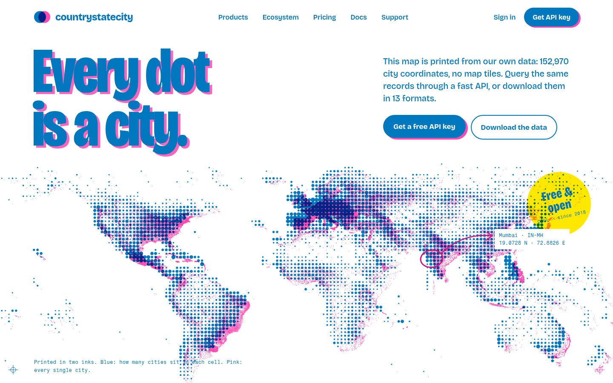
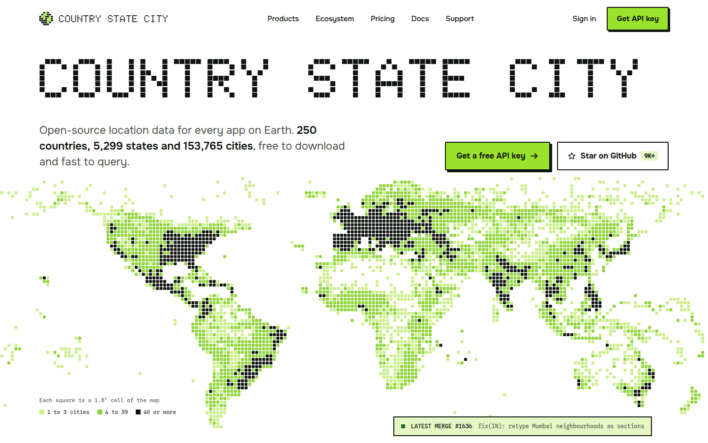
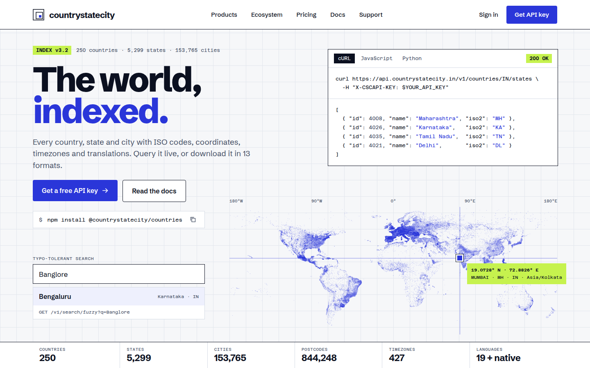
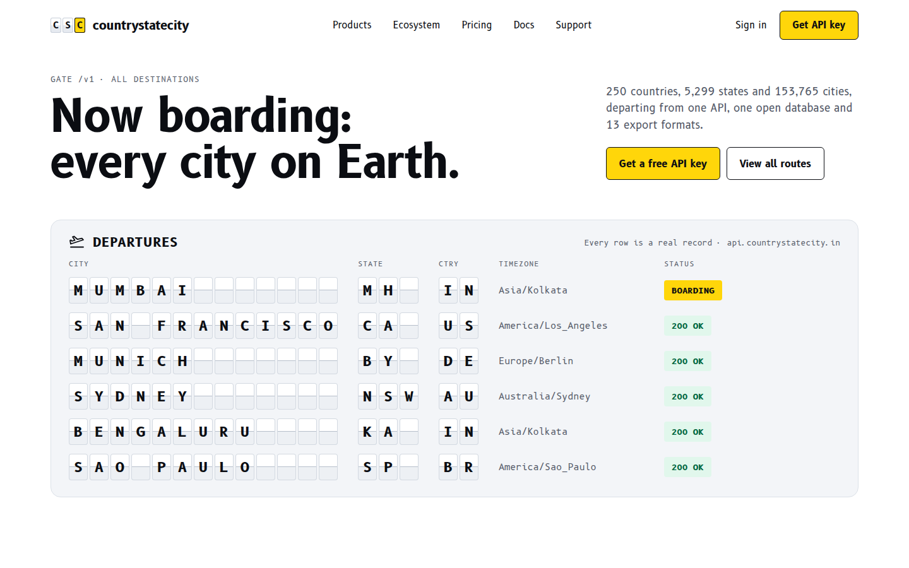
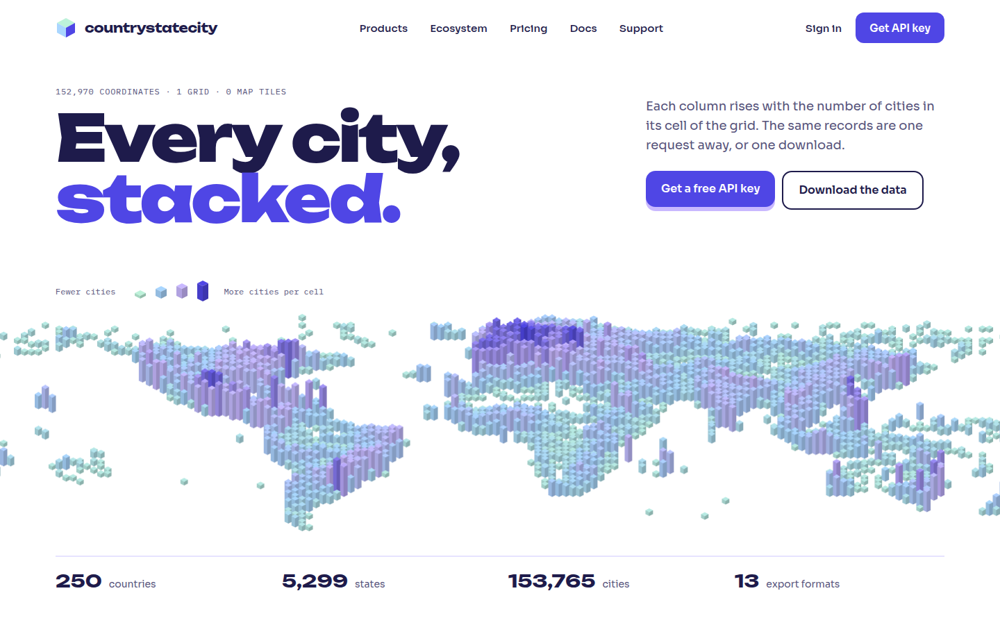
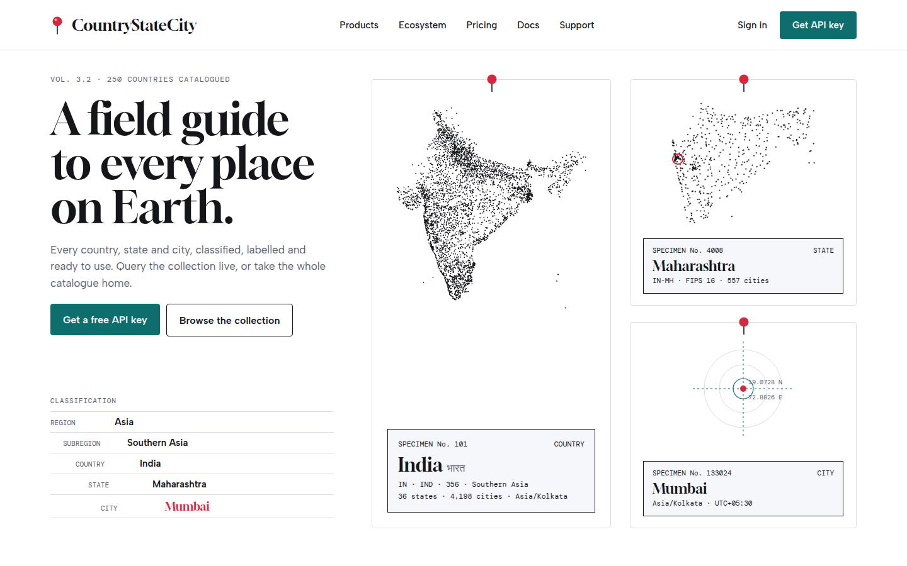
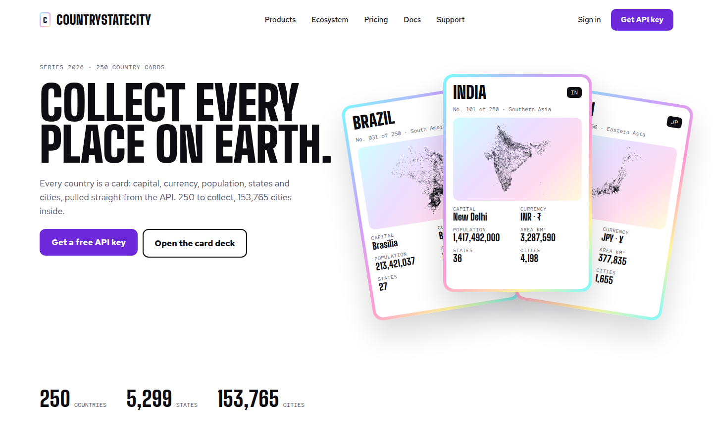
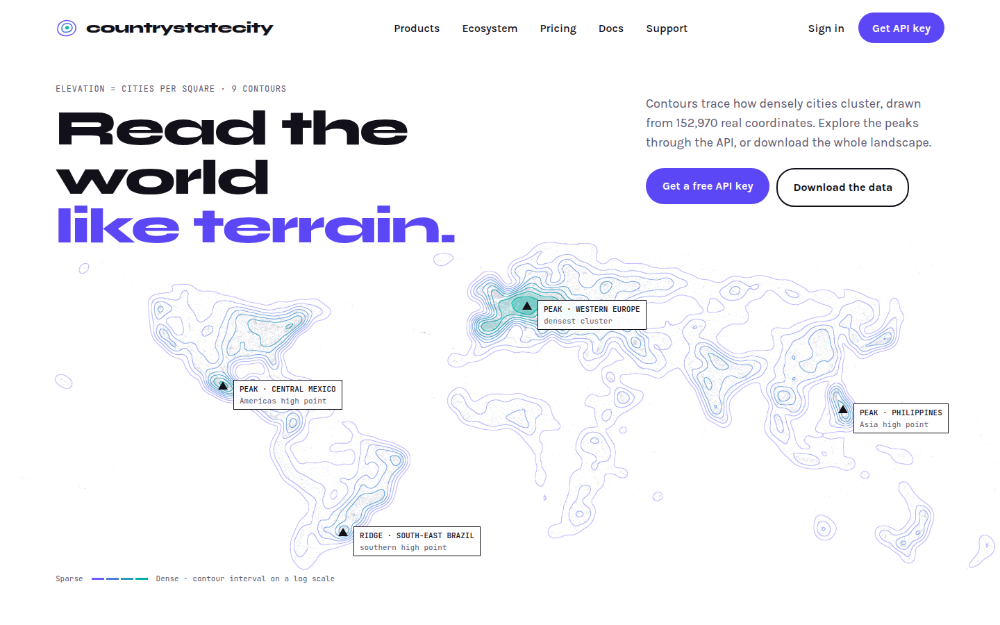

# CSC Style Directions: A to J

Ten light-first home hero explorations for the countrystatecity.in redesign. Each one is a different creative direction for the whole brand: type, colour, signature visual and tone of voice. They are for choosing a direction, not final designs.

| | |
|---|---|
| **Status** | Exploration, awaiting Darshan's pick (one direction, or a mix) |
| **Updated** | 27 September 2026 |
| **Rules** | Every direction follows the [Design Reject List](../reject-list.md): light only, no cream or paper-toned backgrounds, no orange accents, no Newsreader or Hanken Grotesk |
| **Fonts** | Free Google Fonts only |
| **Data** | All place names, IDs, codes, coordinates, timezones and counts are real records from [dr5hn/countries-states-cities-database](https://github.com/dr5hn/countries-states-cities-database) (v3.2, updated 29 July 2026). Every map and silhouette is drawn from the database's own 152,970 city coordinates, with no map tiles or stock imagery. |
| **Logos** | Each direction shows an exploratory mark. Swap in the chosen logo when a direction is taken forward. |

## Files

| Folder | Contents |
|---|---|
| `screenshots/` | One PNG per direction at 1440 × 900, plus a 1440 × 1040 style tile for E |
| `html/` | A standalone HTML page per direction. Open one in a browser; it needs internet for Google Fonts. |
| `assets/` | The data-drawn images the pages use (maps, contours, voxels, silhouettes, guilloche) |

## Overview

| ID | Direction | Headline | Fonts | Key colours |
|---|---|---|---|---|
| A | Transit Line | Change here for every place on Earth. | Overpass, Overpass Mono | `#0B5FFF` `#00A36C` `#E0157A` `#6E3BFF` `#FFC400` on `#FFFFFF` |
| B | Place Passport | Every place. Verified. | Anybody (condensed), Cutive Mono | `#1B4DFF` `#D1246B` `#0E8A5F` on `#FFFFFF` |
| C | Riso Print | Every dot is a city. | Bricolage Grotesque, Fragment Mono | `#0078BF` `#FF48B0` `#FFE800` on `#FFFFFF` |
| D | Pixel Heritage | COUNTRY STATE CITY | Doto, Onest, Spline Sans Mono | `#111511` `#9BE22D` `#1F6B34` on `#FFFFFF` |
| E | Survey Grid | The world, indexed. | Schibsted Grotesk, Azeret Mono | `#2A36D9` `#C6F24E` `#0B1020` on `#F6F7F9` |
| F | Departure Board | Now boarding: every city on Earth. | B612, B612 Mono | `#FFD60A` `#00673F` `#0B0D12` on `#FFFFFF` |
| G | Voxel World | Every city, stacked. | Unbounded, Sora, IBM Plex Mono | `#4F46E5` `#BDF2DA` `#A9D6FF` `#C9B8FF` on `#FFFFFF` |
| H | Field Guide | A field guide to every place on Earth. | Gloock, Albert Sans, DM Mono | `#0E6E6E` `#D7263D` `#14161A` on `#FFFFFF` |
| I | Country Cards | Collect every place on Earth. | Big Shoulders Display, Red Hat Text, Red Hat Mono | `#6D28D9` + holographic foil on `#FFFFFF` |
| J | Data Terrain | Read the world like terrain. | Syne, Karla, JetBrains Mono | `#5B47F5` `#6D5BFF` `#00B3A4` on `#FFFFFF` |

---

## A · Transit Line

- **Idea:** The data hierarchy drawn as a metro map. Four lines leave a "World" interchange and run through region, subregion, country and state to a city: Mumbai, San Francisco, Munich and Sydney. The products are "interchanges" (REST API, Database, Export Tool, npm and PyPI, Update Tool). A yellow wayfinding sign shows the next stop as an API route.
- **Fonts:** Overpass (inspired by highway signage), Overpass Mono
- **Colours:**
  - Base: white `#FFFFFF`, ink `#121417`, slate `#4A5160`
  - Line colours: blue `#0B5FFF`, green `#00A36C`, magenta `#E0157A`, violet `#6E3BFF`
  - Wayfinding sign: yellow `#FFC400`
- **Files:** [`html/A-transit-line.html`](html/A-transit-line.html)

## B · Place Passport

- **Idea:** Every record is a passport page. It shows a security-print guilloche background and a "Place Passport" data page for Mumbai with real ID 133024. There is a machine-readable zone and rubber stamps ("VERIFIED", "ODbL", "ENTRY · REST API"). Bilingual field labels nod to the 19 translation languages.
- **Fonts:** Anybody (variable width, condensed for display), Cutive Mono
- **Colours:**
  - Base: white `#FFFFFF`, ink `#101828`, slate `#475467`, page tint `#F3F6FF`
  - Stamp inks: cobalt `#1B4DFF`, magenta `#D1246B`, green `#0E8A5F`
- **Files:** [`html/B-place-passport.html`](html/B-place-passport.html)

## C · Riso Print

- **Idea:** A two-ink risograph print. A blue halftone layer shows city density per cell, and a pink layer plots every city. The layers are slightly out of register, with registration marks and a sticker. The map is printed from the data itself.
- **Fonts:** Bricolage Grotesque, Fragment Mono
- **Colours:**
  - Base: white `#FFFFFF`
  - Inks: riso blue `#0078BF` (also used for text), fluorescent pink `#FF48B0`
  - Accents: dark pink `#D6127F` for thin lines, yellow `#FFE800`
- **Files:** [`html/C-riso-print.html`](html/C-riso-print.html)

## D · Pixel Heritage

- **Idea:** Carries on the dot-matrix look of the original GitHub README banner. It combines a dot-matrix wordmark headline with a pixel world map, where each square is a 1.8° cell shaded by how many cities it holds. A "latest merge" ticker shows the real latest commit.
- **Fonts:** Doto (dot-matrix), Onest, Spline Sans Mono
- **Colours:**
  - Base: white `#FFFFFF`, ink `#111511`, moss `#4B5249`
  - Greens: lime `#9BE22D`, leaf `#1F6B34`, mint `#E4F7C4`
- **Files:** [`html/D-pixel-heritage.html`](html/D-pixel-heritage.html)

## E · Survey Grid

- **Idea:** Swiss and technical. A graph-paper grid, a live API request and response, a coordinate crosshair on Mumbai, and a typo-tolerant search demo ("Banglore" finds Bengaluru). A data spec strip shows countries, states, cities, postcodes, timezones and languages.
- **Fonts:** Schibsted Grotesk, Azeret Mono
- **Colours:**
  - Base: sheet `#F6F7F9`, grid `#E2E6ED`, white `#FFFFFF`
  - Text: ink `#0B1020`, slate `#475166`
  - Accents: ultramarine `#2A36D9`, lime `#C6F24E`
- **Style tile:** [`screenshots/E-survey-grid-style-tile.png`](screenshots/E-survey-grid-style-tile.png) shows the next step for whichever direction is chosen: logo, palette, type, buttons, code block, pricing card and record card.
- **Files:** [`html/E-survey-grid.html`](html/E-survey-grid.html), [`html/E-survey-grid-style-tile.html`](html/E-survey-grid-style-tile.html)

## F · Departure Board

- **Idea:** A daytime airport split-flap board. Real cities "depart" with their state code, country code and IANA timezone, and each status reads "200 OK".
- **Fonts:** B612 and B612 Mono, typefaces designed for Airbus cockpit displays
- **Colours:**
  - Base: white `#FFFFFF`, board `#F3F5F8`, flaps `#FFFFFF` over `#EDF0F4`
  - Text: ink `#0B0D12`, slate `#525866`
  - Accents: signage yellow `#FFD60A`, go-green `#00673F` on `#E1F7EC`
- **Files:** [`html/F-departure-board.html`](html/F-departure-board.html)

## G · Voxel World

- **Idea:** An isometric 3D world. Each column's height is the number of cities in its 2.4° grid cell, so Europe towers. Soft and playful, with a pastel palette.
- **Fonts:** Unbounded, Sora, IBM Plex Mono
- **Colours:**
  - Base: white `#FFFFFF`, indigo ink `#1E1B4B`, slate `#55527A`
  - Accent: electric indigo `#4F46E5`
  - Pastels: mint `#BDF2DA`, sky `#A9D6FF`, lilac `#C9B8FF`
- **Files:** [`html/G-voxel-world.html`](html/G-voxel-world.html)

## H · Field Guide

- **Idea:** A natural-history display case. India, Maharashtra and Mumbai are pinned as specimens, drawn from their own city coordinates. Their real IDs (101, 4008, 133024) are the specimen numbers, next to a classification key that runs from region down to city.
- **Fonts:** Gloock, Albert Sans, DM Mono
- **Colours:**
  - Base: white `#FFFFFF`, rule `#D9DDE3`, label `#F5F7FA`
  - Text: ink `#14161A`, slate `#5B6270`
  - Accents: museum teal `#0E6E6E`, specimen-pin red `#D7263D`
- **Files:** [`html/H-field-guide.html`](html/H-field-guide.html)

## I · Country Cards

- **Idea:** Holographic trading cards for Brazil, India and Japan. Every stat on the cards (capital, currency, population, area, states, cities) comes from the database. Each card's art is the country drawn from its own city dots.
- **Fonts:** Big Shoulders Display, Red Hat Text, Red Hat Mono
- **Colours:**
  - Base: white `#FFFFFF`, ink `#0D0D12`, slate `#545466`
  - Accent: violet `#6D28D9`
  - Foil: `#7DF9FF` › `#C8A2FF` › `#FF9BD2` › `#FFF59D`
- **Files:** [`html/I-country-cards.html`](html/I-country-cards.html)

## J · Data Terrain

- **Idea:** City density drawn as topographic contours on a log scale, with peaks labelled like summits (Western Europe, Central Mexico, the Philippines, South-East Brazil).
- **Fonts:** Syne, Karla, JetBrains Mono
- **Colours:**
  - Base: white `#FFFFFF`, ink `#121019`, slate `#5A5870`
  - Accents: violet `#5B47F5` / `#6D5BFF`, teal `#00B3A4`
- **Files:** [`html/J-data-terrain.html`](html/J-data-terrain.html)
